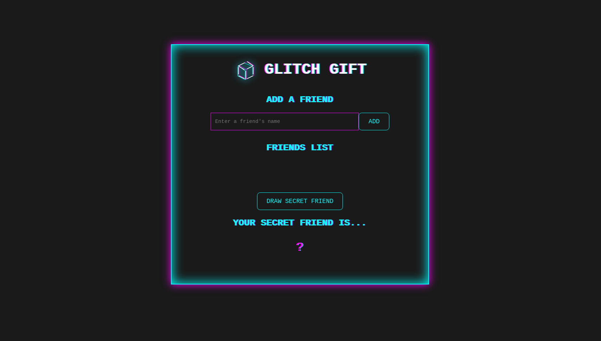

# Glitch Gift

<p align="center">
  
</p>

Este projeto é uma aplicação simples para sortear um "amigo secreto" de forma aleatória. É uma ferramenta divertida para grupos de amigos ou familiares que desejam organizar um sorteio de presentes de forma digital.


> <marquee>Desafie seus amigos e descubra quem é o seu amigo secreto!</marquee>


## Funcionalidades

- **Adicionar Nomes:** Os usuários podem inserir nomes de amigos em um campo de texto e adicioná-los a uma lista visível clicando no botão "Adicionar".
- **Validar Entrada:** Se o campo de texto estiver vazio ao tentar adicionar um nome, um alerta será exibido solicitando um nome válido.
- **Visualizar a Lista:** Todos os nomes adicionados são exibidos em uma lista clara e visível na página.
- **Sorteio Aleatório:** Ao clicar no botão "Sortear Amigo", um nome da lista será selecionado aleatoriamente e exibido na tela.
- **Animação de Sorteio:** Uma animação de "shuffle" é exibida durante o processo de sorteio para uma experiência mais interativa.

## Tecnologias Utilizadas

- **HTML5:** Para a estrutura e conteúdo da página web.
- **CSS3:** Para estilização e animações, incluindo efeitos "glitch" para um visual único.
- **JavaScript:** Para a lógica da aplicação, manipulação do DOM e funcionalidades de sorteio.

## Como Configurar e Rodar o Projeto

Para configurar e rodar este projeto em sua máquina local, siga os passos abaixo:

1.  **Clone o Repositório:**
    ```bash
    git clone https://github.com/mrpunkdasilva/challenge-alura-g9
    cd challenge-alura-g9
    ```

2.  **Instale as Dependências (se houver):**
    Este projeto é puramente front-end e não possui dependências de Node.js para execução. No entanto, se você planeja usar ferramentas de desenvolvimento como um servidor local ou um bundler (como Vite, que pode ter sido usado para iniciar o projeto), você pode precisar instalar as dependências do `package.json`:
    ```bash
    npm install
    ```

3.  **Abra o Projeto no Navegador:**
    Simplesmente abra o arquivo `index.html` em seu navegador web preferido. Você pode fazer isso arrastando o arquivo para a janela do navegador ou clicando duas vezes nele.

    Se você instalou as dependências e o projeto usa um servidor de desenvolvimento (como o Vite), você pode iniciá-lo com:
    ```bash
    npm run dev
    ```
    E então acesse a URL fornecida (geralmente `http://localhost:5173`).

## Uso

1.  **Adicione Amigos:** Digite o nome de um amigo no campo de texto e clique em "Adicionar". Repita para todos os participantes.
2.  **Sortear:** Quando todos os nomes estiverem na lista, clique no botão "Sortear Amigo".
3.  **Resultado:** O nome do amigo secreto sorteado será exibido na tela após uma breve animação.

## Screenshots



## Video Demostração 

<video src=".github/record_app_runing.mp4" controls></video>
